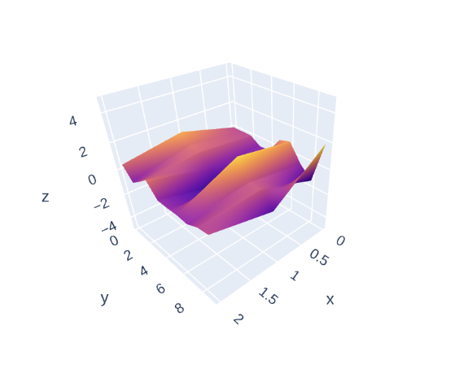
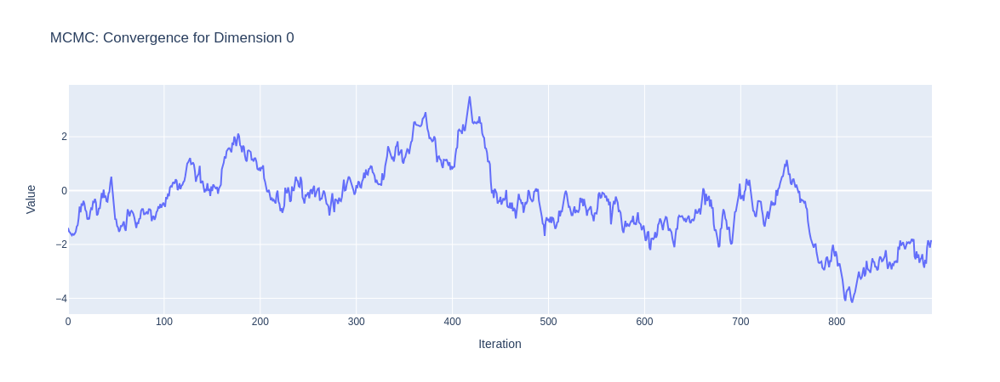

# Approximate Bayesian Computation As An Informed Fuzzing-Inference System

- ### Author: Chris Vaisnor
	- The Johns Hopkins University

	- For graduate course: EN.605.645 - Reasoning Under Uncertainty

Repository Structure:

- /archive - old test notebooks
- /imgs - images for paper
- main.ipynb - main notebook
- VAISNOR_CHRIS_745_research_paper.pdf - paper

